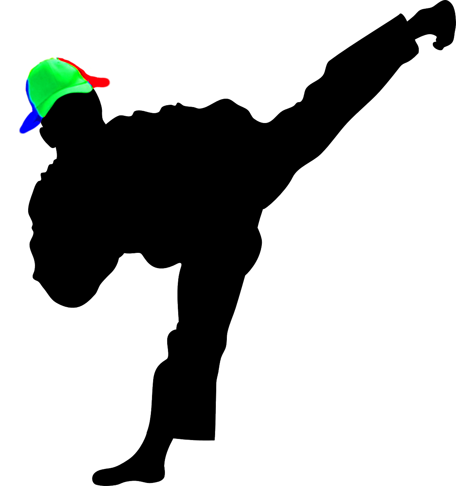

Last time we wrote the code for the bowling game in clojure, it worked but it could be better!!
So I iterated over it with different approach🎳! 

My goal was to be able to do it with even less code and easier to read and follow.

To achieve this goal I had to stop thinking the problem as a player but rather the algorithm for the rules.
I kept forcing the idea on frames and that complicated the code. 
I also had to think the clojure way; more functional, less procedural. My last code had a loops and stateful indexes to iterate over things making the code feel blotted. 

It took me a few Katas to get to this point. 

```clojure
(ns bowling-kata-4.core)

(defn isStrike?
  [rolls]
  (= 10 (first rolls)))

(defn isSpare?
  [rolls]
  (= 10 (apply + (take 2 rolls))))

(defn getBonus
  [rolls]
  (take 3 rolls))

(defn wasLastFrameBonusAdded?
  [rolls]
  (= 2 (count rolls)))

(defn getRollsWithBonuses
  [rolls]
  (cond
    (= 0 (count rolls)) []
    (isStrike? rolls)
    (if (wasLastFrameBonusAdded? rolls)
      []
      (conj (getBonus rolls) (getRollsWithBonuses (drop 1 rolls))))
    (isSpare? rolls)
    (conj (getBonus rolls) (getRollsWithBonuses (drop 2 rolls)))
    :else
    (conj (take 2 rolls) (getRollsWithBonuses (drop 2 rolls)))))

(defn score
  [rolls]
  (->> rolls
       getRollsWithBonuses
       flatten
       (reduce +)))
```

Less than 40 lines of code. 

Its more expressive now! (I love the little functions that came out of it.)

It takes advantage of lazy evaluation with `take` and `drop`. No more index state!

Simple functions, less framing logic (other than dropping rolls to make sure where are on the start of a frame).

I also noticed that I spend less time refactoring (mainly extracting functions) if I refactor between test rather than at the end of the kata.