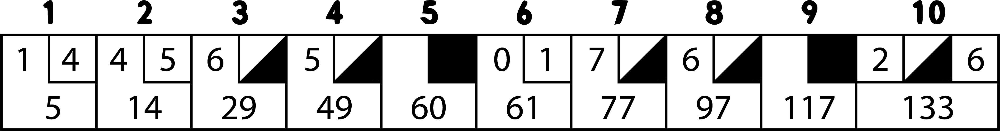

Hey!

New blog website! 

Looks a lot better than what I had, plus writing blogs in MDX is incredible!
The stack for [the blog](https://github.com/donedgardo/blog) is pretty cool too, but more about that on a later blog. 

Today I want to talk about bowling 🎳! 

I took a shot programming the scoring system of bowling in Clojure.
It was harder than I thought. 
It started easily, but my code got messy and quick when it got to calculating strike points. 

Let us take a look. 
As always lets first take a look at the tests:
```clojure
(ns bowling-kata-3.core-spec
  (:require [speclj.core :refer :all]
            [bowling-kata-3.core :refer :all]))

(defn roll-many [n pins]
  (vec (repeat n pins)))

(describe "A gutter game"
  (it "should score 0"
    (should= 0 (score (roll-many 20 0)))))

(describe "A all 1 score game"
  (it "should score 20"
    (should= 20 (score (roll-many 20 1)))))

(describe "1 spare and 3 roll"
   (it "should score 13"
     (should= 16
       (score
         (concat
           [5 5]
           [3]
           (roll-many 17 0))))))

(describe "1 strike and 3 4 roll"
          (it "should score 24"
              (should= 24
                       (score
                         (concat
                           [10]
                           [3 4]
                           (roll-many 16 0))))))

(describe "perfect game"
          (it "should score 300"
              (should= 300
                       (score
                         (roll-many 12 10)))))
```

So I create a vector for all the pins knocked down on each roll and send that to the score function.
Ok so far neat!

Lets take a look at the code that makes this test pass.
```clojure
(ns bowling-kata-3.core)

(def frame-count 10)

(defn last-frame-strike?
  [frame-index frame]
  (and
    (= (inc frame-index) frame-count)
    (= 10 (first frame))))

(defn sum-rolls
  [[frames accum]]
  (loop [index 0
         sum 0]
    (if (< index frame-count)
      (let [frame (nth frames index)]
        (if
          (last-frame-strike? index frame)
          (recur
            (inc index)
            (+ sum 10))
          (recur
            (inc index)
            (+ sum
               (first frame)
               (last frame)))))
      [frames (+ accum sum)])))

(defn strike?
  [roll frames]
  (and
    (= 10 roll)
    (= 0 (mod (count frames) 2))))

(defn create-frames-and-sum-strike-bonus
  [[rolls accum]]
  (loop [index 0
         rolls-with-strike []
         strike-bonus 0]
    (if (< index (count rolls))
      (let [roll (nth rolls index)]
        (if (strike? roll rolls-with-strike)
          (let [next-roll (nth rolls (inc index))
                second-next-roll (nth rolls (+ index 2)) ]
            (recur
              (if (< (count rolls-with-strike) 18)
                (inc index)
                (+ index 3))
              (concat
                rolls-with-strike
                (if (< (count rolls-with-strike) 18)
                  [10 0]
                  [roll next-roll second-next-roll]))
              (+ strike-bonus next-roll second-next-roll)))
          (recur
            (inc index)
            (concat rolls-with-strike [roll])
            strike-bonus)))
      [(partition-all 2 rolls-with-strike)  (+ strike-bonus accum)])))

(defn spare?
  [frame]
  (and
    (not (= 10 (first frame)))
    (= 10 (+ (first frame) (second frame)))))

(defn sum-spare-bonus
  [[frames accum]]
  (loop [index 0
         spare-bonus 0]
    (if (< index 10)
      (let [current-frame (nth frames index)]
        (if (spare? current-frame)
          (let [next-frame (nth frames (inc index))]
            (recur (inc index) (+ spare-bonus (first next-frame))))
          (recur (inc index) spare-bonus)))
      [frames (+ accum spare-bonus)])))

(defn score
  [rolls]
  (->> [rolls 0]
       create-frames-and-sum-strike-bonus
       sum-spare-bonus
       sum-rolls
       last))

```

It works, but I'm not happy about the design.
I like it atm because it is less than 100 lines, but I think that is just a Clojure thing 🤩.

What I don't like is how I have a function that does two things.

`create-frames-and-sum-strike-bonus`!

The function was created to make the strike scoring test pass, exactly where things started getting complicated.
So I found it hard to separate the creating of frames and detecting strikes. They kind of happen simultaneously. One can't exist without the other.

Or does it 🤔?


Somethings I want to experiment with as I repeat this kata over and over:
* I could separate them and create a transformer for each; this may simplify the design. 
* I want to experiment with further use of threading macros. I love how more readable the code is after using them.

