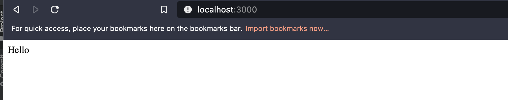

👋 Hello again!!


#### Refactoring our socket server to be used as a library

Our start command for our server only accepts port as an argument. I would like to call the start
method with also the publicDirectory path and the application routing.

This is what we currently have:
```java
 public void start(int port) {
        try {
            serverSocket = new ServerSocket(port);
            ConcurrentHashMap<String, SessionData> sessionData = new ConcurrentHashMap<>();
            while (true)
                new CleanClientHandler(serverSocket.accept(), publicDirectory, sessionData).start();
        } catch (IOException e) {
            e.printStackTrace();
        }
    }
```

So we change the signature to include public dir path for hosting files.
```java
 public void start(int port, String publicPath) {
        try {
            serverSocket = new ServerSocket(port);
            ConcurrentHashMap<String, SessionData> sessionData = new ConcurrentHashMap<>();
            while (true)
                new CleanClientHandler(serverSocket.accept(), publicPath, sessionData).start();
        } catch (IOException e) {
            e.printStackTrace();
        }
```

Ok next lets look at our routing logic. Currently, that's defined inside our `ClientClientHandler`.
```java
  public void run() {
        try {
            CleanHttpRequest request = new CleanHttpRequest(in);
            var router = new HashMap<String, RequestHandler>() {{
                put("/hello", new HTMLRequestHandler(out, "Welcome Screen!"));
                put("/ping", new PingRequestHandler(out));
                put("/guess", new GuessRequestHandler(out, request, sessionData));
                put("*", new FileRequestHandler(out, request, publicDirectory));
            }};
            var route = request.getPath();
            if (!router.containsKey(route))
                route = "*";
            router.get(route).handle();
            out.flush();
            in.close();
            out.close();
            clientSocket.close();
        } catch (Exception e) {
            System.out.println("Error in run");
            e.printStackTrace();
        }
    }
```

Let's move this outside it, so we can potential allow users to define their own application routing.

First we had to separate the route creation from input stream and output streams. We can send those stream 
to our handle method rather than our creation of routes. We do this by applying the Single Responsibility rule to a few
of our classes.

Our Clean Socket server Class:
```java
public class CleanServer {
    private static int port;
    private static String publicDirectory;
    private ServerSocket serverSocket;

    public static void main(String[] args) {
        try {
            setParams(args);
            CleanServer server = new CleanServer();
            HashMap<String, RequestHandler> router = new HashMap<>() {{
                put("/hello", new HTMLRequestHandler("Welcome Screen!"));
                put("/ping", new PingRequestHandler());
                put("/guess", new GuessRequestHandler());
                put("*", new FileRequestHandler(publicDirectory));
            }};
            server.start(port, router);
        } catch (Exception e) {
            e.printStackTrace();
        }
    }

    public void start(int port, HashMap<String, RequestHandler> router) {
        try {
            serverSocket = new ServerSocket(port);
            ConcurrentHashMap<String, SessionData> sessionsData = new ConcurrentHashMap<>();
            while (true)
                new CleanClientHandler(serverSocket.accept(), router, sessionsData).start();
        } catch (IOException e) {
            e.printStackTrace();
        }
    }
   ...
}
```

Notice now our RequestHandlers no longer take in either input, output stream or session data. Speaking of session data 
I moved that to inside our request class:

```java
package clean.socket;

import java.io.BufferedReader;
import java.io.IOException;
import java.io.UnsupportedEncodingException;
import java.net.URLDecoder;
import java.nio.charset.StandardCharsets;
import java.util.HashMap;
import java.util.Map;
import java.util.concurrent.ConcurrentHashMap;

public class CleanHttpRequest {
    private static final String POST_METHOD = "POST";
    private final BufferedReader in;
    private final ConcurrentHashMap<String, SessionData> sessionsData;
    private String method;
    private String path;
    private String protocol;
    private final Map<String, String> headers = new HashMap<>();
    private String body;
    private Map<String, String> postData = new HashMap<>();
    private Map<String, String> cookies;

    public CleanHttpRequest(BufferedReader in, ConcurrentHashMap<String, SessionData> sessionsData) throws Exception {
        this.in = in;
        this.sessionsData = sessionsData;
        setRequestProperties();
    }

    public ConcurrentHashMap<String, SessionData> getSessionData() {
        return sessionsData;
    }
    ...
}
```

When we create our request we pass in our session data, so our handler can use it if it needs it.

Here is how our new and improved ClientHandler
```java
package clean.socket;

import java.io.*;
import java.net.Socket;
import java.util.HashMap;
import java.util.concurrent.ConcurrentHashMap;


class CleanClientHandler extends Thread {
    private Socket clientSocket;
    private BufferedReader in;
    private OutputStream out;
    private HashMap<String, RequestHandler> router;
    private final ConcurrentHashMap<String, SessionData> sessionsData;

    public CleanClientHandler(Socket socket, HashMap<String, RequestHandler> router, ConcurrentHashMap<String, SessionData> sessionsData) throws IOException {
        clientSocket = socket;
        this.router = router;
        this.sessionsData = sessionsData;
        in = new BufferedReader(new InputStreamReader(clientSocket.getInputStream()));
        out = new DataOutputStream(clientSocket.getOutputStream());
    }

    public void run() {
        try {
            CleanHttpRequest request = new CleanHttpRequest(in, sessionsData);
            var route = request.getPath();
            if (!router.containsKey(route))
                route = "*";
            router.get(route).handle(request, out);
            out.flush();
            in.close();
            out.close();
            clientSocket.close();
        } catch (Exception e) {
            System.out.println("Error in run");
            e.printStackTrace();
        }
    }
}
```
#### Server Run from Clojure

The point of all of this refactoring was so we can use it in clojure.

Lets start a lein repl and start a server!

```clj
user=> (def app (clean.socket.CleanServer.))
#'user/app
user=> (def home (clean.socket.HTMLRequestHandler. "Hello"))
#'user/home
user=> (def routes (java.util.HashMap. {"/" home}))
#'user/routes
user=> (.start app 3000 routes)
```
Opening up our browser to localhost:3000 we find:



Tada 🎉!~

Next we'll look into leveraging our reagent code to render html in our new clojure http server! ✌️

❤️

