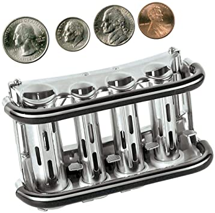

Welcome back!

We are going to tackle a new kata called the Coin Changer!

The Coin Changer problem is the following, given an amount eg `0.35` cents what would be the least amount of change in
coins to equal the value of the given amount (eg. `1 quarter 1 dime`). Simple! Or is it?!

All right, lets start with a failing test!
Let's get a degenerate test, the 0 case.

```clojure
 (it "generates 0 coins"
    (should=
      {:quarters 0 :dimes 0 :nickles 0 :pennies 0} 
      (coin-changer 0)))
```
Awesome lets get it passing

```clojure
(defn coin-changer [amount]
  {:quarters 0 :dimes 0 :nickles 0 :pennies 0}
```

Ha! ez enough. We've gone from failing test (red) to a passing test (green). Lets not forget to refactor if you see smelly code.
Yup lets refactor this to the following:

``` clojure
(def empty-coins
  {:quarters 0
   :dimes 0
   :nickles 0
   :pennies 0})

(defn coin-changer [amount]
  empty-coins)

(it "generates 0 coins"
   (should=
     empty-coins
     (coin-changer 0)))
```

Better! Less duplication of code!

Why lets go red (failing test) again.
Lets get test where we get 1 coin back. I'll skip here a bit but I implemented each test and made it pass until I reached this point:
```clojure
(it "generates 1 quarter"
    (should=
      (assoc empty-coins :quarters 1)
      (coin-changer 0.25)))
  (it "generates 1 dime"
    (should=
      (assoc empty-coins :dimes 1)
      (coin-changer 0.1)))
  (it "generates 1 nickle"
    (should=
      (assoc empty-coins :nickles 1)
      (coin-changer 0.05)))
  (it "generates 1 pennies"
    (should=
      (assoc empty-coins :pennies 1)
      (coin-changer 0.01)))
```
And the passing code looks like this:
```clojure
(defn coin-changer [amount]
  (let [amount-to-get-change (* amount 100)]
    (cond
      (>= (- amount-to-get-change 25) 0)
      (assoc empty-coins :quarters (+ (empty-coins :quarters) 1))
      (>= (- amount-to-get-change 10) 0)
      (assoc empty-coins :dimes (+ (empty-coins :dimes) 1))
      (>= (- amount-to-get-change 5) 0)
      (assoc empty-coins :nickles (+ (empty-coins :nickles) 1))
      (>= (- amount-to-get-change 1) 0)
      (assoc empty-coins :pennies (+ (empty-coins :pennies) 1))
      :else empty-coins)))
```

Notice that I multiply amount by 100, this is to avoid a floating-point issue on the pennies case. Not super happy about the code.
I feel theres maybe a better way to handle floating numbers and maybe how to increase a map value easier.
Lets refactor there seems to be a lot of duplication of code.

```clojure
(defn add-quarter [change]
  (assoc change :quarters (+ (change :quarters) 1)))

(defn add-dime [change]
  (assoc change :dimes (+ (change :dimes) 1)))

(defn add-nickle [change]
  (assoc change :nickles (+ (change :nickles) 1)))

(defn add-penny [change]
  (assoc change :pennies (+ (change :pennies) 1)))

(defn coin-changer [amount]
  (let [amount-to-get-change (* amount 100)]
    (cond
      (>= (- amount-to-get-change 25) 0)
      (add-quarter empty-coins)
      (>= (- amount-to-get-change 10) 0)
      (add-dime empty-coins)
      (>= (- amount-to-get-change 5) 0)
      (add-nickle empty-coins)
      (>= (- amount-to-get-change 1) 0)
      (add-penny empty-coins)
      :else empty-coins)))
```

🤔 Hmmm its better, but I think there is still a lot of duplication specially those helper function (add-penny, etc.) seems
like there is more room for improvement

```clojure
(defn add-coin [coin change]
  (assoc change coin (+ (change coin) 1))

(defn coin-changer-b5 [amount]
  (let [amount-to-get-change (* amount 100)]
    (cond
      (>= (- amount-to-get-change 25) 0)
      (add-coin :quarters empty-coins)
      (>= (- amount-to-get-change 10) 0)
      (add-coin :dimes empty-coins)
      (>= (- amount-to-get-change 5) 0)
      (add-coin :nickles empty-coins)
      (>= (- amount-to-get-change 1) 0)
      (add-coin :pennies empty-coins)
      :else empty-coins))
```

Well thats a lot better. It might be improved further 🤔 maybe by adding some types and adding some type inheritance  to coins.
Maybe we are over designing this. Let's Add more test see where the business rules take us.
Lets add a many coins test case

```clojure
 (it "generates 3 quarters"
    (should=
      (assoc empty-coins :quarters 3)
      (coin-changer 0.75)))
  (it "generates 1 quarter and 1 nickle"
    (should=
      (assoc empty-coins :quarters 1 :nickles 1 )
      (coin-changer 0.30)))
  (it "generates 2 quarter 2 dimes and 2 pennies"
     (should=
       (assoc empty-coins :quarters 2 :dimes 2 :pennies 2)
       (coin-changer 0.72)))
```

And here is the code that makes this pass. Remember in practice and in Kata you make 1 failing test you make it pass refactor if needed and repeat.

```clojure
(def empty-coins
  {:quarters 0
   :dimes 0
   :nickles 0
   :pennies 0})

(defn add-coin [coin change]
  (assoc change coin (+ (change coin) 1)))

(def coin-value {:quarter 25 :dime 10 :nickle 5 :penny 1 })

(defn coin-changer [amount]
  (loop [change empty-coins
         amount-to-get-change (* amount  100)]
    (cond
      (>= (- amount-to-get-change (:quarter coin-value)) 0)
      (recur
        (add-coin :quarters change)
        (- amount-to-get-change (:quarter coin-value)))
      (>= (- amount-to-get-change (:dime coin-value)) 0)
      (recur
        (add-coin :dimes change)
        (- amount-to-get-change (:dime coin-value)))
      (>= (- amount-to-get-change (:nickle coin-value)) 0)
      (recur
        (add-coin :nickles change)
        (- amount-to-get-change (:nickle coin-value)))
      (>= (- amount-to-get-change (:penny coin-value)) 0)
      (recur
        (add-coin :pennies change)
        (- amount-to-get-change (:penny coin-value)))
      :else change)))
```

Ha! Tail recursions, love 'em.

Wanted to make it more readable and remove duplicate code even further I happily ended up with this:
```clojure
(def empty-coins
  {:quarters 0
   :dimes 0
   :nickles 0
   :pennies 0})

(defn add-coin [coin change]
  (assoc change coin (+ (change coin) 1)))

(def coin-value {:quarter 25 :dime 10 :nickle 5 :penny 1 })

(defn should-add-coin? [coin amount]
  (>= (- amount (coin coin-value)) 0))

(defn subtract-coin-amount [coin amount]
  (- amount (coin coin-value)))

(defn coin-changer [amount]
  (loop [change empty-coins
         amount-remaining (* amount  100)]
    (cond
      (should-add-coin? :quarter amount-remaining)
      (recur
        (add-coin :quarters change)
        (subtract-coin-amount :quarter amount-remaining))
      (should-add-coin? :dime amount-remaining)
      (recur
        (add-coin :dimes change)
        (subtract-coin-amount :dime amount-remaining))
      (should-add-coin? :nickle amount-remaining)
      (recur
        (add-coin :nickles change)
        (subtract-coin-amount :nickle amount-remaining))
      (should-add-coin? :penny amount-remaining)
      (recur
        (add-coin :pennies change)
        (subtract-coin-amount :penny amount-remaining))
      :else change)))
```

>“Clean code is simple and direct. Clean code reads like well-written prose. Clean code never obscures the designer’s intent but rather is full of crisp abstractions and straightforward lines of control.
> <br></br> - Grady Booch 

<3

