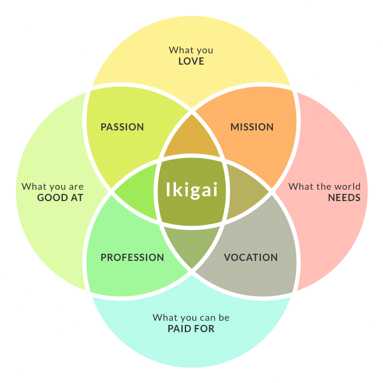

Hello there!

I'm, edgardo carreras... and coding is my [ikigai](https://en.wikipedia.org/wiki/Ikigai). 

Specifically learning and teaching coding.

Today, I'm starting my apprenticeship program under the elites at clean coders. Founded by Micah and Robert C. Martin.

After 10 years of creating software applications, I still felt like I knew very little about the software craft after picking up Robert C. Martin (Uncle Bob)'s book Clean Architecture: A Craftsman's Guide to Software Structure and Design. It has been a game-changer ever since I read it a year ago, specifically test-driven development. So, after reading Uncle Bob's books, I picked up some more recommended authors by  Uncle Bob, eg.  Martin Fowler and Kent Beck, and the neverending journey of improvement continued.

On my first day in the apprenticeship program, they suggested starting a blog/journal to share my experience, so this will have to do! 😀

I'll be learning and using clojure as the primary language in the apprenticeship program.

So far this is what I know about Clojure:
* Smart people use it and want to learn it.
* Its based on lisp
* It works with immutable data structures by default.
* Its purely functional but Object Oriented Programing can still be applied.
* It's dynamically typed
* The language is very descriptive and tends to be more readable (easier to mantain).
* It has great support for concurrency.

I've got Clojure for the Brave and True (book) by my side and some Clojure koems to kick butt!

:bye