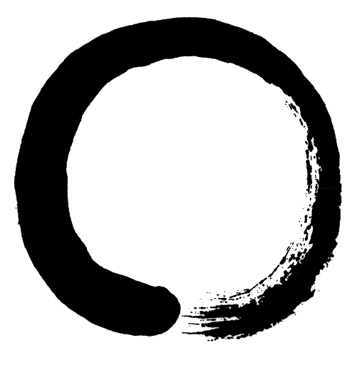

Today I'm focusing on Clojure Koems. Koems are like TDD, but the test are written out for you, so you only have to make them pass.  This [git repository](https://github.com/donedgardo/clojure-koans/tree/develop) is a fork of the clojure koans. The develop branch has the answers if you are curious.
My big AHA moment came after looking at how Clojure composes functions, including higher-order functions. 
```clojure
"Maps and filters may be combined."
(= [10 20 30] (map (fn [x] (* x 10)) (filter (fn [x] (< x 4)) [1 2 3 4 5 6 7 8])))
```

If the anonymous functions had descriptive names, this would read out like beautiful prose.
```clojure
(= [10 20 30] (map multiplyByTen (filter (isLessThanFour?) [1 2 3 4 5 7 8])))
```

So elegant <3!
Another AHA moment was the support Clojure had for polymorphism at runtime. Polymorphism is one of those refactoring tools that I really leverage to help the code adhere to the Single Responsibility Rule. I'm happy to start noticing Clojure as more than just a functional programing language, and more like a complete language.
```clojure
(defmulti diet (fn [x] (:eater x)))
(defmethod diet :herbivore [a] (let [name (:name a)]
                                 (str name  " eats veggies.")))
(defmethod diet :carnivore [a] (let [name (:name a)]
                                 (str name " eats animals.")))
(defmethod diet :default [a] (let [name (:name a)]
                               (str "I don't know what " name " eats.")))
"Multimethods allow more complex dispatching"
(= "Bambi eats veggies."
   (diet {:species "deer" :name "Bambi" :age 1 :eater :herbivore}))
"Animals have different names."
(= "Thumper eats veggies."
   (diet {:species "rabbit" :name "Thumper" :age 1 :eater :herbivore}))
"Different methods are used depending on the dispatch function result."
(= "Simba eats animals."
   (diet {:species "lion" :name "Simba" :age 1 :eater :carnivore}))
"You may use a default method when no others match."
(= "I don't know what Rich Hickey eats."
   (diet {:name "Rich Hickey"})))
```

I later refactored the defmethods to be less verbose but still, be readable.
```clojure
(defmethod diet :herbivore [a] (str (:name a) " eats veggies."))
(defmethod diet :carnivore [a] (str (:name a) " eats animals."))
(defmethod diet :default [a] (str "I don't know what "  (:name a) " eats."))
```

Only a few more koems to go.
Up next, my first Kata = Bowling Game KATA.

:bye

