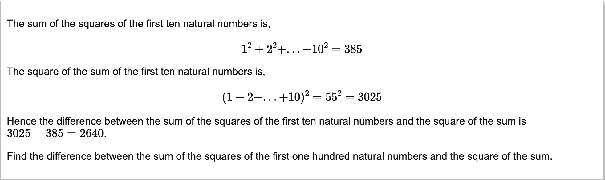

Welcome back!

Today we are continuing our journey through the Euler Project.


4th problem:
---
> A palindromic number reads the same both ways. The largest palindrome made from the product of two 2-digit numbers is 9009 = 91 × 99.
> <br>Find the largest palindrome made from the product of two 3-digit numbers.
  
So let's break this into smaller problems:

a) A function to detect if a number is palindrome.

b) A function that gets a list of possible products of the range of two numbers. 
```clojure
(defn get-list-of-products [n1 n2]
  (for [n1 (range n1)
        n2 (range n2)]
    (* n1 n2))
```
c) A function that gives us a number with a certain amount of digits.(Optional, I could just hardcode the 999). 
Here I'm just thinking something like `(10^(ammount-of-digits))-1`.

So I wrote unit test for each and implemented them.

Our main function will do the following in order:
1. Create two numbers with three digits (999). (function c)
2. Get a list of possible products of two number (function b)
3. Remove duplicates of the list (Optional, this is for performance I don't want to iterate on the list on unnecessary values.)
4. Filter the list to only those who are a palindrome.
5. Sort from the lowest number to the highest.
6. Take the last value.

Tada 🎉! 

While I was implementing function `c` I learned that there isn't a exponential function in the cloure core library, 
but instead I had to install a math library `[org.clojure/math.numeric-tower "0.0.4"]`.

My biggest take away was lazy sequence and taking advantage of it in function `b`
where instead of looping using a stateful index I just leverage `range n` that returns a list from 0 up to `n`.
On top of this lazy sequence I use nested for loop to make a combination of all the possible values of two list!

Clojure is so elegant!

5th Problem
-------

>2520 is the smallest number that can be divided by each of the numbers from 1 to 10 without any remainder.
<br> What is the smallest positive number that is evenly divisible by all of the numbers from 1 to 20?

So from what I got from this problem is that 2520 is the lowest number that can be divided by `[1 2 3 4 5 6 7 8 9 10]`
and the remainder is `0` for every division. 

So if we want to get the lowest number we probably can start a 10 and go on to 11 after that lets call this variable `n`.

So we loop over `n` `inc`reasing it each iteration. If at any time we find a `n` that has a remainder of 0 when dividing 
against `every?` `[1 2 3 4 5 6 7 8 9 10]` then we return the number!

Straight forward!
Only problem, my algorithm took almost 70 sec to find the lowest posible number who is divisible by [1-20]! 
Read over the Euler Project rules, and it seems its fine, for now. 

Onwards!!

6th Problem
-----


Hmmm you know what we do here:
* A function that returns the sum of the squares of the first `n` natural numbers.
* A function that returns the squares of sums of the first `n` natural numbers.
* A function that uses these two functions and gets the difference.

I love how Euler gives you like test samples which are great for the test for each individual function above.
Its like they also believe in TDD!

Straight forward!

Onwards!