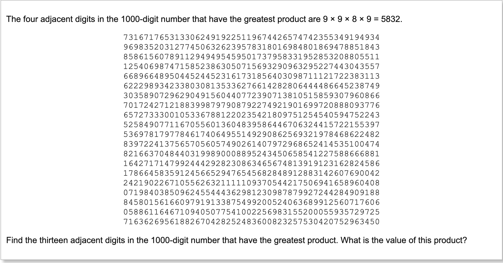

Welcome back!

Lets continuing our journey through the Euler Project.

7th problem:
---
> By listing the first six prime numbers: 2, 3, 5, 7, 11, and 13, we can see that the 6th prime is 13.
>    What is the 10 001st prime number?

So how do we determine if a number is a `prime?` 🤔

We know a number `n` is prime number if its a natural number greater than 1 that is not a product of two smaller natural numbers. 
* So we create a list called `divisors` from 2 to the square root (highest product number to be a prime) of `n`. (clojure `range` came in handy here!) 
* We can `map` this `divisors` list into function that generates a new list `remainders` where we get the remainder of `n` with every possible `divisor`.
* We return true if non (`not-any?`) of the `remainders` list is `0`.

Let us create a function that generates a list of `n` amount of primes. 
and just returns the `nth` prime number.

Ok lets break this apart into smaller bites.
* Lets start with `n` as 2 and move our way upwards.
* We ask if the n is `prime?` if it is we add it to the list `primes`.
* We stop iterating over `n` when we've found the `nth` prime.

Problem 7th
------

This reminded me a lot of our [Bowling Kata](/blog/bowling-kata-red-green-refactor), the way we add the bonus but in this 
we multiply bonuses.

I tackled this problem by first making a list of digits in the order the problem is providing them.
After creating the list I just loop over the list by `take`ing `n` next numbers and checking if the prodcut of them is bigger than the previous.
If the product is bigger than the previous product then we call the recursion loop again with the new biggest product and `drop`ing the first digit from the list.
Otherwise, we just continue until we evaluated all the products in the list and return the biggest-product!

Problem 10
-----
>The sum of the primes below 10 is 2 + 3 + 5 + 7 = 17.
>  Find the sum of all the primes below two million.

Ha! another prime numbers problem! Good we have some nice functions from previous problems.
I'm going to leverage my prime list generation function here and just loop over the generation until the number reaches 2 million.
After that I'll just `apply` + to the list and solve the problem! EZ!
 
😎  

  
