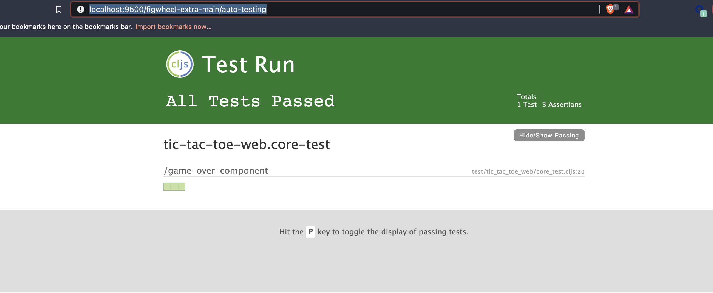
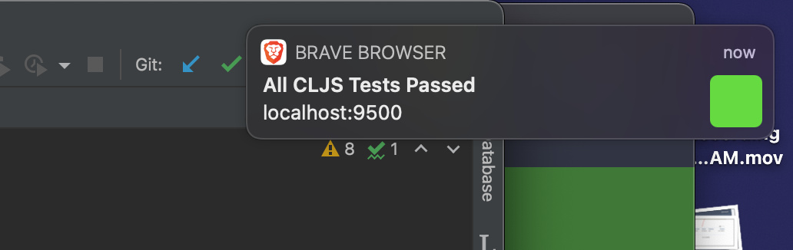

Today I'm going to share what I've learned in getting a Reagent project setup for Behaviour Driven Development.

These are the tools I've picked.
* [Figwheel](https://figwheel.org) (hot reloading, test watchers, easy setup.)
* [Reagent](https://reagent-project.github.io/) (our ui library, react-like for clojurescript)
* [React Testing Library](https://testing-library.com/docs/react-testing-library/intro) (ui testing library)

Some roadblocks I found is by trying to run `lein fig:test` as test failed for some unknown reason.
Later I found out that `lein fig:test` doesn't import npm modules, and I almost gave up on the whole thing.
My core modules where importing correctly npm modules and I later found that just by running `lein fig:build` runs
both the application and test runners both on hot-reload (changing code reloads both test and application)!.
The application runs at `http://localhost:9500/` and my test runner at `http://localhost:9500/figwheel-extra-main/auto-testing`.

The test runner even includes push notifications ❤️




So let's create a component that renders the game over state, including announcing the winner if there are any.

Here are our test:
```clojure
(ns tic-tac-toe-web.core-test
  (:require
    [tic-tac-toe-clj.constants :refer [new-game]]
    [tic-tac-toe-web.core :refer [game-over]]
    ["@testing-library/react" :as rtl]
    [reagent.core :as r]
    [cljs.test :refer-macros [deftest is testing use-fixtures]]))

(use-fixtures :each
              {:after rtl/cleanup})

(defn with-mounted-component [comp f]
  (let [mounted-component (rtl/render (r/as-element comp))]
    (try
      (f mounted-component)
      (finally
        (.unmount mounted-component)
        (r/flush)))))

(deftest game-over-component
  (testing "It should be empty if the game is not over"
    (with-mounted-component
      [game-over new-game]
      (fn [component]
        (is
          (nil?
             (-> component
                 (.queryByText "Game Over!")))))))

  (testing "It should say Game over."
    (with-mounted-component
      [game-over (assoc new-game :over? true)]
      (fn [component]
        (is
          (not (nil? (-> component
                         (.queryByText "Game Over!")
                         (.-innerHTML))))))))

  (testing "It should display the winner"
    (with-mounted-component
      [game-over (assoc new-game :over? true :winner "X")]
      (fn [component]
        (is
          (= false
             (nil? (-> component
                 (.queryByText "X Wins!")))))))))
```

Here I create a helper function, `with-mounted-component` that allows me to render it in a test dom. 
I also have three test:
* That the "Game Over!" text doesn't show if the game is not over.
* That the "Game Over!" text does show if the game is over.
* That the "X Wins!" text does show if X is the winner.

Here is the code component make these pass.

```clojure
(defn game-over [game]
  [:h2 (cond
         (not (nil? (:winner game)))
         (str (:winner game) " Wins!")
         (:over? game)
         (str "Game Over!")
         :else
         nil)]
```
------

So what kind of tests should we write for the tic-tac-toe board 🤔? 

* It renders empty spaces when the game is empty.
* It renders filled spaces with proper player mark when the game is not empty.
* It changes the board state properly when clicking on an empty board spot.

Alright! Let's see how these test look like, onward!

```clojure
(defonce game-state (atom new-game))

(defn play-on-space [space]
  (swap! game-state (play @game-state space X)))

(deftest board-component-test
  (testing "It should be empty if the board is empty"
    (with-mounted-component
      [board-component (:board @game-state) play-on-space]
      (fn [component]
        (is
          (= 9
             (-> component
                 (.queryAllByLabelText #"empty-board-space")
                 count))))))

  (testing "It should change board state when clicking on an empty index"
    (with-mounted-component
      [board-component (:board @game-state) play-on-space]
      (fn [component]
        (click-element (.getByLabelText component "empty-board-space-[0 0]"))
        (is
          (= X
             (-> component
                 (.queryByLabelText (str X "-play-" [0 0]))
                 (.-innerHTML))))))))
```

Next we'll make these pass!

❤️


