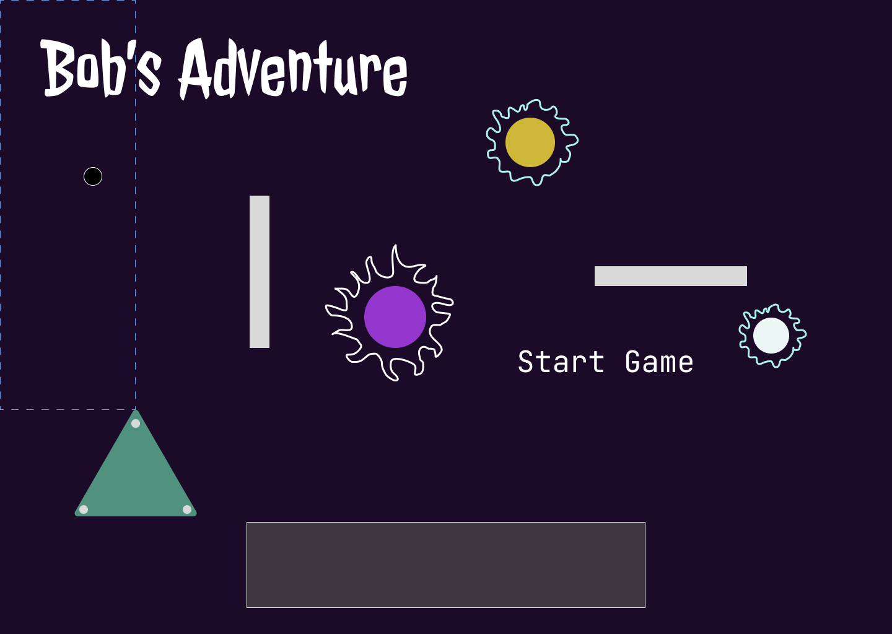
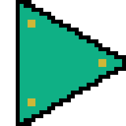
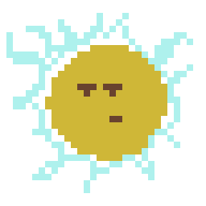
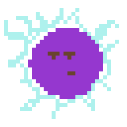
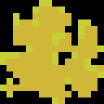
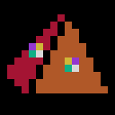
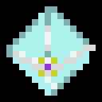

In this blog post, you'll learn about my experience participating in a game jam, the challenges I faced while creating 
[my game](https://donedgardo.itch.io/bobs-adventure), the tools and techniques I used, and the lessons I learned
along the way. Whether you're a beginner or an experienced game developer, you'll find valuable insights and
inspiration to help you make your own games.

Last week was the start of a game jam hosted by the Bevy team, the game engine for Rust developers. In a game jam, people
have a chance to collaborate or solo create a game in a minimal time and usually with a theme constriction.
I joined late but started working solo on the idea of a game on Thursday and had until Monday to deliver it.

# Where to start?

So many things to consider; it was exciting, but I quickly got overwhelmed.
I've written code for games before but have yet to wear the hat of music, art, and game designer.
For help to figure out where to begin, I took out a book I started reading a few years back called.
"Players Making Decisions" by Zack Hiwiller. In it, Hiwiller suggests beginning with a problem statement to drive the
process. He uses an example in the book: "What if a racing game was determined by style instead of just speed. (Project Gotham 2001)".

The problem statement I took as a challenge for this game jam: *What if you played as an alien exploring new worlds in a
top-down adventure game?*.
Not a great problem statement, probably not unique, but I wanted to know the answers to this question.

Next, Hiwiller goes on into more detailed steps on defining a game loop to describe how a "turn" would look like.
Here is where I spend too much time and never decide on one thing. I read this book
twice and got stuck planning this step.
I had so many features I wanted to deliver, but I needed more time. I know rookie mistake, but I just went straight to
the code, as I had a bunch of actionable ideas that I wanted to test out.

Things I had in mind for the game:
* Allow players to explore different worlds. Like traveling between worlds and moving around in a top-down world.
* Different items with different side effects and craftable items with different abilities.
* A Dialog System for the story, I wanted to give the experience of traveling to time and a story based on logs of Bob (the player).
* AI system for monsters and life in the game. Minimum monsters must be aggressive towards you and chase you down, maybe other behaviors.
* Health and damage system for a simple game loop.
* UI for start menu, game over, describing objects in the world, health, and inventory system.
* Allow players to interact with items in the world.
* An inventory system to keep track of these items.
* A combat system that allowed you to parry projectiles and shoot enemies.
* Immersive music that placed the player in a mysterious mood.
* AI entities can become your workers to build things for you.

Yeah, looking back... maybe a little too much, let's see.

# The Process

So I had all these systems and structures that I wanted to build and represent in the graphic interface. Luckily I had
some of these systems I wrote as I explored using
[Test-driven development in Game Development with Bevy](/blog/tdd-in-rust-game-engine-bevy), like the
player movement, my cursor system, and a bit of the animation system. This was a big 'aha' moment regarding
how Bevy's ECS architecture allowed my previous code to be fully compatible with a new game! In addition, bevy ECS architecture combined with
Rust's generic and trait system made my code highly reusable; we'll see this in an example later on the week.

### Rough Sketch

Next, I wanted to work on what I had been putting off, making the art. I had minimal experience (like one time I drew
a Beholder from D & D) with pixel art, but it would be much more feasible than learning 3d modeling, rigging, and texturing from scratch.
Regardless, I went head first and started creating a palette of colors that would embody the aesthetics of the game's look, 
so I opened up Figma and drew a mood board.



After having a rough idea of what the game was going to be about, the colors and logo of the game, I called it a night 
and went to sleep as I had Comicon the next day. After the Comicon, I continued drawing what Bob's ship would look like.
Painting the ufo bolstered my confidence in creating the art myself, as I usually buy it from an artist.



### Beam and interactions

Next, I wanted to draw something that would indicate that the player was interacting with the world, so I drew the
beam and it felt rewarding after putting it all together.

`video: https://www.youtube.com/embed/ovgWlELhMiI`

### World Tiles

Then I needed tiles to lay out our world, I made them as needed.


I was feeling confident, and on a roll, so I drew monsters to give them life and animated them, as well as Bob's ship.




### Dialog UI

Now that I had the art to play around with, I wanted to work on the tutorial and introduction part of the game and story.
So I worked on a scene for dialog and Added this traveling at the light-of-speed effect.

`video: https://www.youtube.com/embed/Mu-c4nDaYFo `

That looked cool!

With the dialog system complete, I went to bed as it was already past bedtime.

### Items and resources
The next day, Saturday, I woke up earlier than usual excited and feeling the pressure of the deadline coming up. I worked on
getting collision events for the beam of light and some items I created, like the herbs, to heal up. I got carried away with things
and made them like gold, water, element 251, and some ancient artifacts that looked pretty cool!







Most of Saturday was me drawing and animating. The rest of the day I spent furiously trying to code the inventory and UI for it,
I was exhausted but pushed through with caffeine and more spaghetti code. Talking of spaghetti code, I had to force myself 
many times not to try and refactor and not to write tests before writing code. By the end of Saturday or, more likely, 
the beginning of Sunday, I had most of the pieces I wanted for the game but no game loop, music, combat, or AI system. 
I had a lot of work cut out for me Sunday.

### Inventory system
Sunday came, and again woke up earlier than usual and started cranking out some code; from here, I stopped at the deadline,
which was in 24 hours. First, I had to decide what my game would not do, so I could finish at least a minimum of features 
that felt the most rewarding. I decided to focus on the world-exploring aspect of the game and concentrate on that. 
So I sprinkled some essential proximity detection on NPC so they aggro and follow you. Next implemented the damage 
and health system, including colliders for those. Finally, I drew some new level tiles, like the water and the waterfall 
level, and made the herb items heal you.

`video: https://www.youtube.com/embed/-Dh4TYlLYvo`

Lastly, I worked on the music, like the last 2 hours of the deadline. I put on my headphones, jacked my piano to the
Macbook, and booted up Garage Band. After finding some sounds, I wanted
I made a song that made the user feel immersed in mystery.

I slapped the soundtrack to the engine and played it on a loop, and we were good to go!
`soundcloud:https://soundcloud.com/edgardo-carreras-951861025/bobsadventure?si=56aee1bf63d84e749f20203dd1b6f799 `

### What went well?
Doing the art and animations seemed daunting at first, but once I got a few pixels in the canvas and some shapes, what seems
so abstract was becoming real, and this gave the focus to continue.
Another thing that went well was the ability to reuse systems from past games and better understand how ECS helps.
I write more reusable code for future projects.
Creating music is the most rewarding of all the hats I have worn, and I will explore that further.

### What went wrong?
Skipping the decision-making process of what the game loop would look like ahead of time costs me a lot of effort and focus.
I needed to decide what the game would play like instead of spreading out my focus on many different generic features.

Another thing that could have gone better was the item and inventory system's architecture.
I noticed this on the last day of the game jam when I was updating my UI for the inventory system and to hack this part of the code:

```rust
pub fn inventory_ui(
    mut commands: Commands,
    mut beam_up_event: EventReader<BeamUpEvent>,
    inventory_panel_q: Query<Entity, With<InventoryPanel>>,
    item_q: Query<&Item>,
    herb_q: Query<&Herbs>,
    org_q: Query<&Organism>,
    yellow_q: Query<&YellowOrganism>,
    gold_q: Query<&Gold>,
    element_q: Query<&Element251>,
    water_q: Query<&Water>,
    weapon_q: Query<&WeaponArtifact>,
    shield_q: Query<&ShieldArtifact>,
) {
    if let Ok(inventory_panel) = inventory_panel_q.get_single() {
        for ev in beam_up_event.iter() {
            if let Ok(item) = item_q.get(ev.0) {
                let id = commands.spawn((
                    InventoryButton,
                    item.clone(),
                    ButtonBundle {
                        style: Style {
                            padding: UiRect::new(Val::Px(2.), Val::Px(2.), Val::Px(2.), Val::Px(2.)),
                            size: Size::new(Val::Px(24.), Val::Px(24.)),
                            ..default()
                        },
                        image: UiImage::new(item.texture.clone()),
                        ..default()
                    })).id();
                if let Ok(element) = herb_q.get(ev.0) {
                    commands.entity(id).insert(element.clone());
                }
                if let Ok(element) = org_q.get(ev.0) {
                    commands.entity(id).insert(element.clone());
                }
                if let Ok(element) = yellow_q.get(ev.0) {
                    commands.entity(id).insert(element.clone());
                }
                if let Ok(element) = gold_q.get(ev.0) {
                    commands.entity(id).insert(element.clone());
                }
                if let Ok(element) = element_q.get(ev.0) {
                    commands.entity(id).insert(element.clone());
                }
                if let Ok(element) = water_q.get(ev.0) {
                    commands.entity(id).insert(element.clone());
                }
                if let Ok(element) = weapon_q.get(ev.0) {
                    commands.entity(id).insert(element.clone());
                }
                if let Ok(element) = shield_q.get(ev.0) {
                    commands.entity(id).insert(element.clone());
                }
                commands.entity(ev.0).despawn_recursive();
                commands.entity(inventory_panel).add_child(id);
            }
        }
    }
}
```


Yeah, not pretty. This mess was due to the philosophy I took at the beginning of the jam, no Test-driven Development,
no refactoring; let's figure things out first and worry about that when we need to worry about it.

### What would I do differently if I had to do it again?
Next solo game jam, I would take Hiwiller's advice and define a game loop before trying things without focus.
Additionally, I would also change the no refactoring rule. Instead, I would be more flexible and refactor obtrusive code.

## Conclusion

Knowing how to stay focused is a crucial skill in achieving success in any aspect of life. By implementing
the tips and strategies discussed in this blog post, such as minimizing distractions, setting goals, and taking breaks,
you can improve your ability to concentrate and remain productive. Remember that staying focused is not always easy, but
with practice and determination, you can overcome the challenges and stay on track to reach your desired outcomes.


