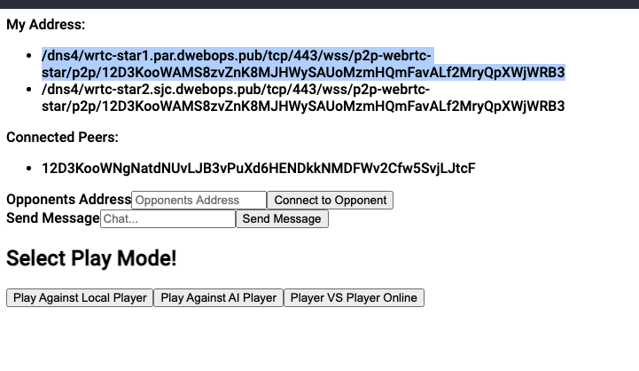

👋!!

Today we'll be looking into LibP2P helper libraries from our IPFS library we mention yesterday.

So today's main goal is to explore the IPFS library and successfully create a peer to peer connection implementation
in our Clojurscript.

A few things I want add as utility functions for our player vs player feature is:
* Creating a node.
* List in the UI my nodes multiaddresses.
* Subscribe to a topic
* List in the UI the list of peers connected to my node and topic.
* Form input to connect to a peer
* Form to publish messages to topic.

After a whole day tinkering the library I got all these features. Check out this screenshot of the UI:



Here is the implementation of that ui in clojurscript.
```clojure
(ns ^:figwheel-hooks tic-tac-toe-web.create-room
  (:require
    [cljs.core.async :refer [go]]
    [reagent.core :refer [atom]]
    [cljs.core.async.interop :refer-macros [<p!]]))

(def room-state (atom {:node nil :my-addresses [] :peer-ids [] :opponent-address nil :msg-input nil}))

(defn get-peer-ids [node topic]
  (. (. node -pubsub) (peers topic)))

(defn create-ipfs-node []
  (.create js/Ipfs
           (clj->js {:config
                     {:Addresses
                      {:Swarm
                       ["/dns4/wrtc-star1.par.dwebops.pub/tcp/443/wss/p2p-webrtc-star"
                        "/dns4/wrtc-star2.sjc.dwebops.pub/tcp/443/wss/p2p-webrtc-star"]}}
                     })))


(defn connect-to-peer [multiaddr]
  (. (. (:node @room-state) -swarm) (connect multiaddr)))

(defn subscribe-to-topic [node topic handle-message]
  (. (. node -pubsub) (subscribe topic handle-message)))

(defn publish-msg [topic msg]
  (. (. (:node @room-state) -pubsub) (publish topic msg)))

(defn log-messages [msg]
  (js/console.log (. (. msg -data) (toString))))

(defn create-ipfs-room [topic]
  (go
    (let [node (<p! (create-ipfs-node))
          my-addresses (map #(.toString %) (. (<p! (.id node)) -addresses))
          handleMessage log-messages
          subscription (<p! (subscribe-to-topic node topic handleMessage))
          interval (js/setInterval #(do
                                      (go
                                        (let [peer-ids (<p! (get-peer-ids node topic))]
                                          (swap! room-state assoc :node node :my-addresses my-addresses :peer-ids peer-ids))))
                                   3000)]
      nil)))

(defn connect-to-peer-form []
  (fn []
    [:div
     [:label "Opponents Address"]
     [:input {:type        "text"
              :value       (:opponent-address @room-state)
              :on-change   #(swap! room-state assoc :opponent-address (-> % .-target .-value))
              :placeholder "Opponents Address"}]
     [:button {:on-click #(connect-to-peer (:opponent-address @room-state))} "Connect to Opponent"]]))

(defn send-msg-form [topic]
  (fn []
    [:div
     [:label "Send Message"]
     [:input {:type        "text"
              :value       (:msg-input @room-state)
              :on-change   #(swap! room-state assoc :msg-input (-> % .-target .-value))
              :placeholder "Chat..."}]
     [:button {:on-click #(publish-msg topic (:msg-input @room-state))} "Send Message"]]))

(defn create-room []
  (let [topic "clean-tic-tac-toe"
        create-room (create-ipfs-room topic)]
    (fn []
      [:div
       [:div "My Address: "
        [:ul
         (for [address (:my-addresses @room-state)]
           [:li {:key address} address])]
        [:div "Connected Peers: "
         [:ul
          (for [peer-id (:peer-ids @room-state)]
            [:li {:key peer-id} peer-id])]
         [:div [connect-to-peer-form]]
         [:div [(send-msg-form topic)]]]]])))
```

Tomorrow will start adding UI and UX to players interested in playing vs online.

<3!


