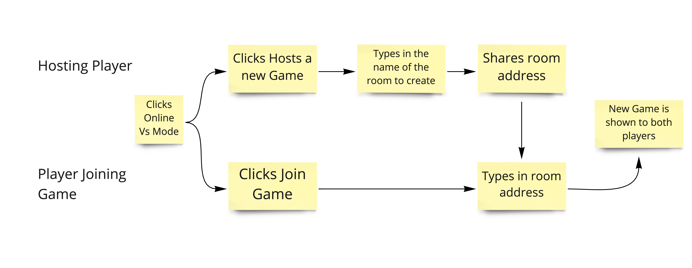

👋!!

Last time we looked at the implementation requirements in order to have a bi-directional
communication between players interested in playing a tic tac toe game online.

Today we'll be looking how we want our players experience would look like.

We have two types of user:
* Player who wants to host a new game.
* Player who wants a join a game.

Here is a high level experience flow for each user.



This diagram allows us to describe better what kind of specifications we could use for our UI tests:
* On the play options component we want to have a new option for `Online Vs Mode`
* On clicking the online vs option the player should see two options: join or host a new game.
* On clicking the `host a new game options` the user should see an input with the label `New Room Name`
* On clicking the `host a new game options` the user should see a disabled button with the label `Create Room`
* After typing the room name in the room name input the `Create Room` button becomes enabled.


* After clicking the `Create Room` button the hosting player should see "waiting for opponent to join" on the screen.
* After clicking the `Create Room` button the hosting player should see "share this room address to your opponent!" on the screen.
* After a user clicks `Join Game` option it should show an input with the label `Room Addresss`.
* After a user clicks `Join Game` option it should show a disabled button with the label `Join Room`.
* After a user types in the 'Room Address' input it should enable the `Join Room` button.
* After clicking the `Join Game` button it should show the new game board.

-----
### Implementation
* On the play options component we want to have a new option for `Online Vs Mode`
Test:
```clojure
 (testing "It should show Online VS Mode option"
    (with-mounted-component
      [play-menu]
      (fn [component]
        (is
          (label-component-in-dom? component ":online-vs-mode")))))
```
Production Code:
```clojure
(def play-mode-options
  [{:label (:local-mode INTL) :value :local}
   {:label (:ai-mode INTL) :value :ai}
   {:label (:online-vs-mode INTL) :value :online-vs}])
```

* On clicking the online vs option the player should see two options: join or host a new game.
Test
```clojure
(testing "It should create or join room options after clicking online vs moe"
    (with-mounted-component
      [play-menu]
      (fn [component]
        (click-element (.getByLabelText component ":online-vs-mode"))
        (is
          (label-component-in-dom? component "join-game"))
        (is
          (label-component-in-dom? component "host-game")))))
```
Production Code:
```clojure
(def online-options
  [{:label (:host-game-option INTL)
    :value :host-game}
   {:label (:join-game-option INTL)
    :value :join-game}])

(defn play-menu []
  (let [options (atom default-game-options)
        go-back-to-menu #(reset! options default-game-options)]
    (fn []
      (cond
        (nil? (:play-mode @options))
        [play-mode-menu #(swap! options assoc :play-mode %)]
        (and (= :ai (:play-mode @options))
             (nil? (:ai-difficulty @options)))
        [difficulty-ai-menu #(swap! options assoc :ai-difficulty %)]
        (and (= :ai (:play-mode @options))
             (nil? (:first-player @options)))
        [goes-first-menu #(swap! options assoc :first-player %)]
        (= :online-vs (:play-mode @options))
        [online-vs-menu]
        :else
        [tic-tac-toe-board go-back-to-menu @options]))))
```
* On clicking the `host a new game options` the user should see an input with the label `New Room Name`
Test:
```clojure
(testing "It should show an New Room Name input after clicking host game option"
    (with-mounted-component
      [play-menu]
      (fn [component]
        (click-element (.getByLabelText component ":online-vs-mode"))
        (click-element (.getByLabelText component "host-game"))
        (is
          (label-component-in-dom? component "new-room-input")))))
```
Production code: 
```clojure
(defn create-room-form []
  [:div
   [:label (:create-room-name-label INTL)]
   [:input {:aria-label "new-room-input"}]])

(defn play-menu []
  (let [options (atom default-game-options)
        go-back-to-menu #(reset! options default-game-options)]
    (fn []
      (cond
      ...
        (and (= :online-vs (:play-mode @options))
             (= :host-game (:online-mode @options)))
        [create-room-form]
        :else
        [tic-tac-toe-board go-back-to-menu @options]))))
```
* On clicking the `host a new game options` the user should see a disabled button with the label `Create Room`
Test:
```clojure
  (testing "It should show an Create Room button disabled after clicking host game option"
    (with-mounted-component
      [play-menu]
      (fn [component]
        (click-element (.getByLabelText component ":online-vs-mode"))
        (click-element (.getByLabelText component "host-game"))
        (is (= true (-> component
                        (.queryByLabelText "create-room-button")
                        (. -disabled)))))))
```
Production code:
```clojure
(defn create-room-form []
  [:div
   [:label (:create-room-name-label INTL)]
   [:input {:aria-label "new-room-input"}]
   [:button {:aria-label "create-room-button"
             :disabled true}
    (:create-room-button INTL)]])
```
* After typing the room name in the room name input the `Create Room` button becomes enabled.
Test:
```clojure
 (testing "It should enable the Create Room button after typing on the room name input "
    (with-mounted-component
      [play-menu]
      (fn [component]
        (click-element (.getByLabelText component ":online-vs-mode"))
        (click-element (.getByLabelText component "host-game"))
        (change-input (.getByLabelText component "new-room-input") "room-name")
        (is (= false (-> component
                         (.queryByLabelText "create-room-button")
                         (. -disabled)))))))
```
Production Code:
```clojure
(defn create-room-form []
  (let [room-name (atom "")]
    (fn []
      [:div
       [:label (:create-room-name-label INTL)]
       [:input {:aria-label "new-room-input"
                :type "text"
                :value @room-name
                :on-change #(reset! room-name (-> % .-target .-value))}]
       [:button {:aria-label "create-room-button"
                 :disabled   (= "" @room-name)}
        (:create-room-button INTL)]])))

```

We'll see the implementation of our missing specifications!

<3!


