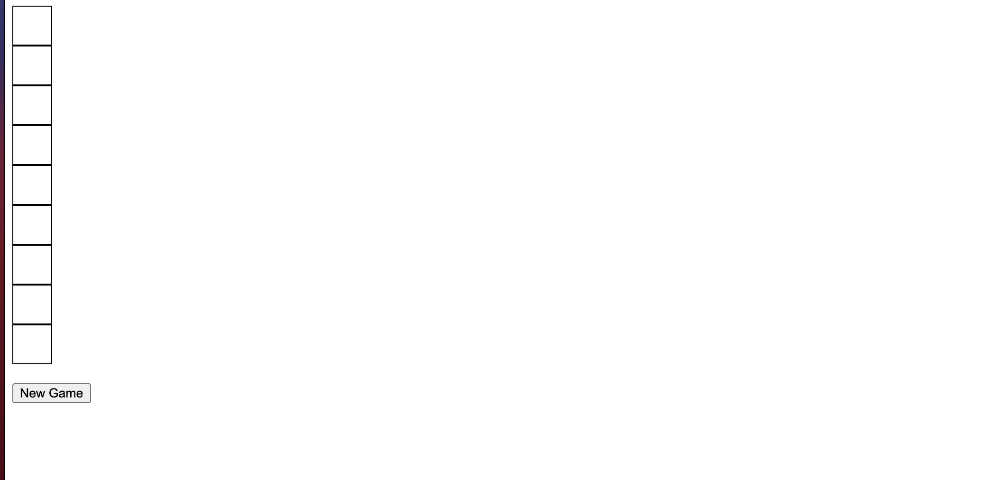
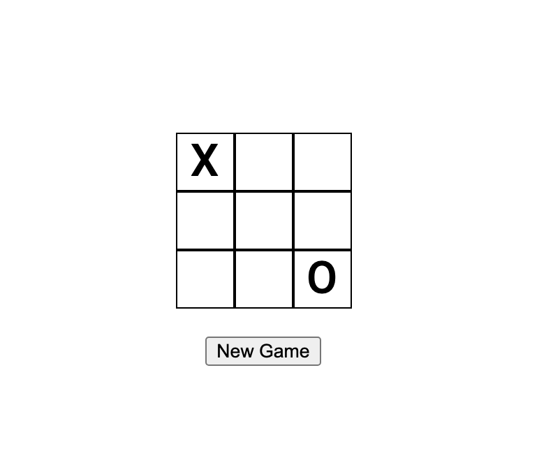

👋

Today we are going to improve the styling of our tic-tac-toe, we've been focusing on behaviour and functionality up until
now. This is what we have now:



So I want to center the board in the middle of the screen.
Lets add some css.

```css
:root {
  font-family: 'Roboto', sans-serif;
}
.space {
    height: 40px;
    width: 40px;
    border: 1px solid black;
    justify-content: center;
    align-items: center;
    text-align: center;
    font-size: 32px;
}

.game {
    display: flex;
    flex: 1;
    height: 100vh;
    flex-direction: column;
    align-items: center;
}

.board {
    width: 140px;
    display: flex;
    flex-wrap:wrap;
    align-content: center;
    flex:1;
    align-items: center;
    justify-content: center;
}
```


Alright, that's better. Let's think a bit more about the User Experience.
I want the player to face a menu with 2 options first. 
* Play Against AI
* Play Against Local Player

After picking the **play against AI option** I want to give them the option these difficulty options:
* Easy
* Medium AI
* Hard AI

After picking an **AI difficulty** I will ask the player who should go first:
* Me
* AI

So let's add a test for the first play options.
```clojure
(deftest play-options-component-test
  (testing "It should show play local option"
    (with-mounted-component
      [play-options]
      (fn [component]
        (is
          (= false
            (nil?
              (-> component
                  (.queryByLabelText "play-local-player"))))))))
  (testing "It should show play ai option"
    (with-mounted-component
      [play-options]
      (fn [component]
        (is
          (= false
             (nil?
               (-> component
                   (.queryByLabelText "play-ai-player"))))))))
```
Here is the production code for passing these test.

```clojure
(defn play-options []
  [:div
   [:button {:aria-label "play-local-player"} "Play Against Local Player"]
   [:button {:aria-label "play-ai-player"} "Play Against AI Player"]]
```
I have a lot of these test checking to see if some UI component is visible in the DOM so lets create a helper function to
reuse and remove the duplicate test code.
```clojure
(defn label-component-in-dom? [component label]
  (= false
     (nil?
       (-> component
           (.queryByLabelText label))))
(deftest play-options-component-test
  (testing "It should show play local option"
    (with-mounted-component
      [play-options]
      (fn [component]
        (is
          (label-component-in-dom? component "play-local-player")))))
  (testing "It should show play ai option"
    (with-mounted-component
      [play-options]
      (fn [component]
        (is
          (label-component-in-dom? component "play-ai-player"))))))
```
Red Green Refactor! ✅ 

Ok so when the player clicks the `play-local-player` option I want to show them the
tic-tac-toe board, so they can start playing.

Test:
```clojure
(testing "It should empty board after clicking local player option"
    (with-mounted-component
      [play-options]
      (fn [component]
        (click-element (.getByLabelText component "play-local-player"))
        (is
          (expect-empty-board component)))))
```

Production code
```clojure
(defn play-options []
  (let [options (atom {:play-mode nil})]
    (fn []
      (cond
        (nil? (:play-mode @options))
        [:div
         [:button {:aria-label "play-local-player"
                   :on-click   #(swap! options assoc :play-mode :local)}
          "Play Against Local Player"]
         [:button {:aria-label "play-ai-player"}
          "Play Against AI Player"]]
        :else
        [tic-tac-toe-board])))
```
✅ 😎 

Ok I noticed we are not showing whose turns is it.

Let's add a test for that!
```clojure
(testing "It should show X as active players turn."
    (with-mounted-component
      [tic-tac-toe-board]
      (fn [component]
        (is
          (not
            (nil?
              (-> component
                  (.queryByText "Player O's Turn!"))))))))
  (testing "It should show O as active players turn."
    (with-mounted-component
      [tic-tac-toe-board]
      (fn [component]
        (click-element (.getByLabelText component "empty-board-space-[0 0]"))
        (is
          (not
            (nil?
              (-> component
                  (.queryByText "Player O's Turn!"))))))))
```

The code that makes this pass:
```clojure
(defn player-turn [game]
  (if (:over? game)
    nil
    [:p (str "Player " (:active-player game) "'s Turn!")]))

(defn tic-tac-toe-board []
  (let [game (atom new-game)]
    (fn []
      [:div.game
       (let [board (:board @game)
             spaces (sort (keys board))]
         [:div.board
          (map-indexed
            (fn [index, space]
              (board-space board space #(swap! game play space)))
            spaces)
          [:div
           [player-turn @game]
           [game-over @game]
           [reset-button #(reset! game new-game)]]])]))
```

I have some duplicate code in the test so I'll make a helper function to simulate playing in a board position.

```clojure
(defn play-position [component position]
  (click-element (.getByLabelText component (str "empty-board-space-" position))))
```

Red, green and refactor! **Onward** 🤺!

I want to add a new feature where once the player is on the tic-tac-toe board I want players to be able to go back to the
play options menu.

This is our test:
```clojure
(testing "It should empty board after clicking local player option"
    (with-mounted-component
      [play-options]
      (fn [component]
        (click-element (.getByLabelText component "play-local-player"))
        (is
          (expect-empty-board component)))))
```

And I needed and optional argument on the board component and I've learned about & [] in function arguments
This is the production code:
```clojure
(defn play-options-menu [on-back]
  [:button {:aria-label "play-options-menu"
            :on-click on-back} "Play Options"])

(defn tic-tac-toe-board [& [on-back]]
  (let [game (atom new-game)]
    (fn []
      [:div.game
       (let [board (:board @game)
             spaces (sort (keys board))]
         [:div.board
          (for [space spaces]
              (board-space board space #(swap! game play space)))
          [:div
           [player-turn @game]
           [game-over @game]
           [play-options-menu on-back]
           [reset-button #(reset! game new-game)]]])])))

(defn play-options []
  (let [options (atom {:play-mode nil})]
    (fn []
      (cond
        (nil? (:play-mode @options))
        [:div
         [:button {:aria-label "play-local-player"
                   :on-click   #(swap! options assoc :play-mode :local)}
          "Play Against Local Player"]
         [:button {:aria-label "play-ai-player"}
          "Play Against AI Player"]]
        :else
        [tic-tac-toe-board #(swap! options assoc :play-mode nil)])))
```

Getting there, getting there.

That's it for today, tomorrow will work on implementing the AI difficulty and allowing the player to play against the AI.

😊


