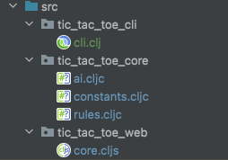
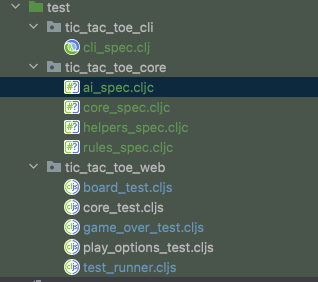

Today I want realized that working with two different repositories for our tic tac toe game is becoming painful to mantain.
We made some updates to the core system that is written in clj and broke the cli implementation as we refactored the api as we
did performance improvements. 

I would like to share today what I've learned of colocating my clj code with my cljs code.

My goal is to be able to have one repository of three libraries, each with its own tests.
* tic-tac-toe-core (Rules of game, ai, utility functions)
* tic-tac-toe-web (Reagent app of the game.)
* tic-tac-toe-cli (CLI app of the game)

Currently, I only have two repositories. One with the clj code of the core modules and CLI applications with its test.
Next I have a project for the web version that has a copy of the core libraries but in cljs and its own test.

I've added all my projects into one src folder under our tic-tac-toe repository:
I've also changed the clj core modules that where shared across environments (JVM and Google Closure) into cljc.

And move each package tests to teh test folder

On our lein project.clj configuration we made sure to include the dev dependencies missing (speclj and specify the folder for tests).

Now we share code across projects, have tests on each of them also in the same repository.

With having the option to share code accross platforms we remove duplication and its easier to maintain our projects!

