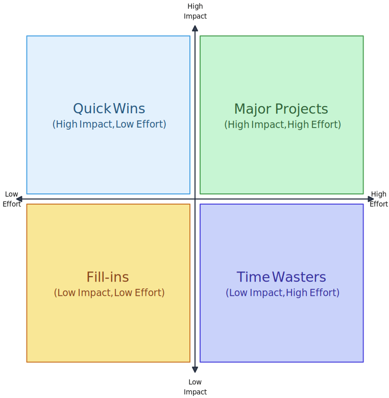

👋 Hello there!

*This is Day 2 of a 7-day dialogue on reducing work in progress. [Read Day 1 here](https://edgardocarreras.com/daily/wip-dialogue-day-1-stop-starting).*

---

Yesterday's question: how do you pick one thing when everyone wants everything?

Well, it depends. How many pizza teams do you have? Teams small enough that a large pizza can feed them. And I'm not talking about frontend teams, backend teams, and don't get me started on QA teams. I'm talking about multi-disciplinary teams: frontend, backend, database, security, whatever specialist you need.

If you have one of those, well, you guessed it. You have to pick one.

How do you pick?

Get the team and stakeholders together.

Have the stakeholders write down their requests in story format: *As a [type of user] I want [deliverable] so that [reason].*

Draw a cross on a whiteboard. Vertical line is value. Horizontal line is effort.

Pick a story and put it in the middle. Ask: is this high effort or low effort? Have everyone participate. Move it left and right as the team discusses, nudging on each argument.

Ask: how much value does this bring? Repeat, moving up or down.

Repeat for each story.

When you're done, pick the low hanging fruit first. Lowest effort, highest value. Top left quadrant. Leave the rest for later.

Sometimes it's easier than that. Maybe one request simply can't be fulfilled. Maybe one would bring back feedback that makes it the obvious choice.

And if you have three multi-disciplinary teams? Ask whether each request comes from a different value stream. Then have each team pick one.

---

**The skeptic pushes back:**

*"Fine. The team picks one thing. Everyone agrees. Monday morning, all hands on deck. Then Wednesday happens. A production bug. A CEO drive-by. A stakeholder who 'forgot' to mention a compliance deadline."*

*"How do you protect the focus once you've established it?"*

---

That's tomorrow's question.

Yours,
Ed
